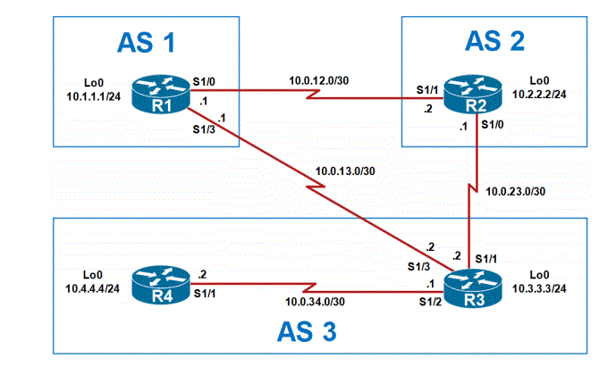

# Notes

Here is written the complete set of commands step-by-step for the configuration given by the instructor as part of an academy

## Topology



## Description

This network is made of 4 routers (i'm using the c7200 router for every device in this network) connected with serial links between them from 3 different AS (Automous System), R1 is in the AS 1, R2 in AS 2, R3 and R4 in AS 3 (check the given [Topology](#topology) for more info)

## Protocols

In this topology is used:

- BGP (Border Gateway Protocol): Network protocol used to connect routers between one or more AS is used in one of the following way:
  - IBGP (Internal Border Gateway Protocol): for intra-AS router communication
  - EBGP (External Border Gateway Protocol): for inter-AS router communication

## Commands Used

### Disclaimer

I'm excluding the commands "enable" and "configure terminal" from this section

### Initial setup

Declaration of ports, Loopbacks and router id in preparation for the bgp

#### Router 1 (R1)

```
interface Loopback0

 ip address 10.1.1.1 255.255.255.0
interface Loopback1
 ip address 192.168.1.1 255.255.255.255
interface Loopback2
 ip address 172.16.1.1 255.255.255.255
interface Serial1/0

 ip address 10.0.12.0 255.255.255.252
 no shutdown
interface Serial1/1
 ip address 10.0.13.1 255.255.255.252
 no shutdown
router bgp 1
 bgp router-id 1.1.1.1
```

#### Router 2 (R2)
```
interface Loopback0
 ip address 10.2.2.2 255.255.255.0
interface Serial1/0
 ip address 10.0.12.2 255.255.255.252
 no shutdown
interface Serial!/1
 ip address 10.0.23.1 255.255.255.252
 no shutdown
router bgp 2
 bgp router-id 2.2.2.2
```

#### Router 3 (R3)

```
interface Loopback0
 ip address 10.3.3.3 255.255.255.0
interface Serial1/0
 ip address10.0.23.2 255.255.255.252
 no shutdown
interface Serial1/1
 ip address 10.0.23.2 255.255.255.252
 no shutdown
interface Serial 1/2
 ip address 10.0.34.1 255.255.255.252
 no shutdown
router bgp 3
 bgp router-id 3.3.3.3
```

#### Router 4 (R4)

```
interface Loopback0
 ip address 10.4.4.4 255.255.255.0
interface Serial1/0
 ip address 10.0.34.2 255.255.255.252
 no shutdown
router bgp 4
 bgp router-id 4.4.4.4
```

### BGP

#### R1

```
router bgp 1
 !neighbors
 neighbor 10.0.12.2 remote-as 2
 neighbor 10.0.13.2 remote-as 3
 !advertise the internal loopbacks
 network 10.1.1.0 mask 255.255.255.0
 network 192.168.1.1 mask 255.255.255.255
 network 172.16.1.1 mask 255.255.255.255
 ! avertise route maps
 neighbor 10.0.12.2 route-map TO_R2 out
 neighbor 10.0.13.2 route-map TO_R3 out
 !route maps
route-map TO_R2 permit 10
 match ip address prefix-list LO0
route-map TO_R2 permit 20
 match ip address prefix-list LO1
route-map TO_R3 permit 10
 match ip address prefix-list LO0
route-map TO_R3 permit 20
 match ip address prefix-list LO2
 !prefix lists
ip prefix-list LO0 seq 10 permit 10.1.1.0/24
ip prefix-list LO1 seq 10 permit 192.168.1.1/32
ip prefix-list LO2 seq 10 permit 172.16.1.1/32
```

#### R2

```
router bgp 2
 neighbor 10.0.12.1 remote-as 1
 neighbor 10.0.23.1 remote-as 3
 network 10.2.2.0 mask 255.255.255.0
 neighbor 10.0.23.1 route-map NO_R1_LO1 out
ip prefix-list NO_R1_LO1 seq 10 permit 192.168.1.1/32
 !route maps
route-map R2-R3 deny 10
 match ip address prefix-list NO_R1_LO0
route-map R2-R3 permit 20
route-map R2_FAV permit 10
 set local-preference 200
```

#### R3

```
router bgp 3
 neighbor 10.0.13.1 remote-as 1
 neighbor 10.0.23.2 remote-as 2
 neighbor 10.0.34.4 remote-as 3
 neighbor 10.0.13.1 route-map R3-R1 out
 neighbor 10.0.23.2 route-map R3-R2 out
 neighbor 10.0.34.4 route-map R3-R4 out
 !
ip prefix-list NO_R1_LO2 seq 10 deny 172.16.1.1/32
route-map R3-R1 deny 10
 match ip address prefix-list NO_R1_LO2
route-map R3-R1 permit 20
route-map R3-R2 deny 10
 match ip address prefix-list NO_R1_LO2
route-map R3-R2 permit 20
route-map R3-R4 deny 10
 match ip address prefix-list NO_R1_LO2
route-map R3-R4 permit 20
```

#### R4

```
router bgp 3
 neighbor 10.0.34.3 remote-as 3
 network 10.4.4.0 mask 255.255.255.0
```

#### Notes for after you finish

Don't forget to send the command:

>write memory

to save the configuration in the nvram of the device, or in my case for GNS3, to save in the project

### Check

on every router:

```
show ip interface brief
```

everything relevant should be up

then:
```
show ip bgp summary
```

to check the bgp status and neighbors

---

Should be done, in GNS3 it works and the routers are connected correctly

## Credits

Writeup done by ExNoise [LEGAL NAME REDACTED] with the help of internet for documentation in case of forgetfulness of some commands
